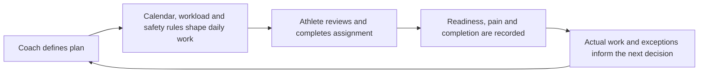

# Player Development OS

**AI-assisted athlete development platform | Public product portfolio**

Player Development OS is a product designed to help baseball athletes, guardians, and coaches turn long-term development goals into safe, calendar-aware daily execution.

This repository is a **sanitized public product portfolio**. It demonstrates product discovery, workflow design, prioritization, safety and privacy decisions, AI-assisted development, testing, and commercialization planning. It contains no real youth-athlete identity, private calendar data, credentials, health information, or production records.

[View the synthetic public demo](https://player-development-os.nikolz78.chatgpt.site/) · [Read the case study](docs/CASE-STUDY.md) · [Tour the product operating record](docs/REPOSITORY-TOUR.md) · [See the roadmap](docs/ROADMAP.md)

## The problem

Youth baseball development is fragmented across team schedules, private instruction, strength work, throwing programs, recovery, nutrition, and informal communication. Athletes and families often reconcile those inputs manually, while coaches lack a consistent view of what was assigned, completed, changed, or missed.

## The product response

Player Development OS brings those workflows into one operating loop:

## My role

I conceived the product and led the work across:

- product discovery and problem definition;
- product strategy and roadmap development;
- workflow and interaction design;
- requirements and acceptance criteria;
- AI-assisted product development;
- safety, privacy, and youth-data constraints;
- testing, release evidence, and operational documentation;
- pilot planning and commercialization analysis.

## Product capabilities

- Calendar-aware daily assignments
- Coach planning and overrides
- Readiness and pain gating
- Rolling throwing-workload controls
- Practice and game reconciliation
- Deterministic plan reconciliation after disruptions
- Shared assignment and logging prescriptions
- Progress, command, velocity, strength, and recovery tracking
- Age-appropriate athlete engagement mechanics
- Role-based access and guardian workflows
- Multi-athlete product architecture in controlled staging

## August 1, 2026 product evidence update

A cross-product parity review produced several material corrections and planning decisions:

- Safety restrictions now generate the final actionable assignment rather than appearing beside a conflicting throwing plan.
- Strength assignments and completed-work logging now resolve from the same exercise, set-count, and effort prescription.
- Rolling plan reconciliation now preserves phase intent while accounting for actual workload, readiness restrictions, team-calendar changes, displaced work, recovery sequences, and return bridges.
- Age-adaptive engagement behavior was completed through the technical gate; final guardian/minor-response treatment remains subject to legal approval.
- The roadmap was rebaselined around platform-owner evidence, controlled migration rehearsal, pilot protocol, and qualified legal review.
- A post-pilot equipment recommendation and affiliate infrastructure initiative was documented with provider-independent, coaching-first rules.
- A governed drill-video inventory and rights-aware workflow was documented without publishing licensed training materials.

[Review the updated public roadmap](docs/ROADMAP.md)

## What this portfolio demonstrates

This project provides direct evidence of the ability to:

- identify a real operational problem;
- translate domain knowledge into product requirements;
- design an end-to-end user workflow;
- make and document product and technical tradeoffs;
- build and test an AI-assisted product;
- establish privacy and safety constraints;
- reconcile defects consistently across product environments;
- operate through explicit gates, evidence, and work-in-progress limits;
- iterate toward a scalable commercial model.

## Current stage

| Area | Status |
|---|---|
| Working single-athlete product | Operational |
| Synthetic public demonstration | Live |
| Product, safety, architecture, and operating model | Documented |
| Multi-athlete identity, onboarding, and plan generation | Technically gated in isolated staging |
| Rolling plan reconciliation | Passed across working product, demo, and staging |
| Age-adaptive engagement | Technical gate substantially complete; one legal dependency remains |
| Owner account, migration, and pilot protocol | Next controlled gates |
| External pilot activation | Blocked pending retained legal and readiness evidence |
| Commercial launch | Not launched |

## Portfolio map

- [Product case study](docs/CASE-STUDY.md)
- [Repository and operating-record tour](docs/REPOSITORY-TOUR.md)
- [Product story](docs/PRODUCT-STORY.md)
- [Major product decisions](docs/PRODUCT-DECISIONS.md)
- [Product roadmap](docs/ROADMAP.md)
- [Safety and privacy boundary](docs/SAFETY-AND-PRIVACY.md)
- [Build and operating approach](docs/BUILD-APPROACH.md)
- [Public demo](https://player-development-os.nikolz78.chatgpt.site/)
- [Michael J. Nichols — GitHub profile](https://github.com/MichaelJNichols)

## Important boundary

The active production and development repository remains private. This public repository intentionally excludes source code, credentials, private deployment details, real athlete information, private calendars, sensitive performance or health records, unapproved legal material, and copyrighted training resources that are not authorized for redistribution.
