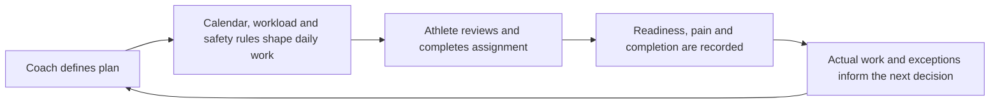

# Player Development OS

**AI-assisted athlete development platform | Public product portfolio**

Player Development OS is a product designed to help baseball athletes, guardians, and coaches turn long-term development goals into safe, calendar-aware daily execution.

This repository is a **sanitized public product portfolio**. It demonstrates product discovery, workflow design, prioritization, safety and privacy decisions, AI-assisted development, testing, release governance, and commercialization planning. It contains no real youth-athlete identity, private calendar data, credentials, health information, or production records.

[View the synthetic public demo](https://player-development-os.nikolz78.chatgpt.site/) · [Read the case study](docs/CASE-STUDY.md) · [Tour the product operating record](docs/REPOSITORY-TOUR.md) · [See the roadmap](docs/ROADMAP.md) · [See related builds](docs/RELATED-BUILDS.md)

## The problem

Youth baseball development is fragmented across team schedules, private instruction, strength work, throwing programs, recovery, nutrition, and informal communication. Athletes and families often reconcile those inputs manually, while coaches lack a consistent view of what was assigned, completed, changed, or missed.

## The product response

Player Development OS brings those workflows into one operating loop:

## My role

I conceived the product and led the work across:

- product discovery and problem definition;
- product strategy and roadmap development;
- workflow and interaction design;
- requirements and acceptance criteria;
- AI-assisted product development;
- safety, privacy, and youth-data constraints;
- testing, release evidence, and operational documentation;
- pilot planning and commercialization analysis.

## Product capabilities

- Calendar-aware daily assignments
- Coach planning and overrides
- Readiness and pain gating
- Rolling throwing-workload controls
- Practice and game reconciliation
- Deterministic plan reconciliation after disruptions
- Shared assignment and logging prescriptions
- Progress, command, velocity, strength, and recovery tracking
- Age-appropriate athlete engagement mechanics
- Athlete profile and assigned-coach context
- Role-based access and guardian workflows
- Multi-athlete product architecture in controlled staging

## August 14, 2026 portfolio update

The work has expanded materially since the first public portfolio snapshot.

### Player Development OS / P2

- P2 has advanced from architecture and onboarding definitions into a controlled multi-role staging product with release-control evidence, athlete-profile work, rendered-role infrastructure, and pilot-gate enforcement.
- Mobile athlete-profile presentation was tested with synthetic fixtures and accepted after real-device review; disposable review records were removed after validation.
- Release controls were strengthened so pilot activation depends on retained hosted evidence rather than source completion alone.
- The August 14 weekly close retained the external pilot as **not yet activated**: hosted Cloudflare acceptance, exact runtime/data-state evidence, cleanup evidence, and remaining pilot gates still control family contact.
- Jackson V1 remains isolated from P2 and external pilot work.

### Support / funding infrastructure

- A canonical voluntary-support model was defined using Stripe-hosted payment flows rather than custom payment handling.
- The support experience was implemented on the Rogue Baseball Intelligence public site and documented for consistent use across approved PDOS surfaces.
- Support is intentionally separate from athlete entitlement: contributing does not buy coaching access, change product permissions, or weaken pilot gates.

### Rogue Baseball Intelligence public site

- The company landing page received a full product-story and visual pass, including a product-focused hero, clearer narrative hierarchy, accessibility/metadata cleanup, and dedicated tablet/mobile layouts.
- Real-device mobile review exposed layout issues that were corrected rather than relying only on desktop responsive simulation.
- The public site now provides the broader Rogue Baseball Intelligence umbrella for development products, research tools, and future experiments.

### Scouting Notebook

A new baseball research/scouting workstream is now being built inside the private Rogue Baseball Intelligence repository.

- The Scouting Notebook combines multiple public baseball-data perspectives rather than presenting a single metric as truth.
- Current data work includes MLB/Statcast-style outcome and bat-tracking context, FanGraphs-derived rate/value context, Baseball-Reference WAR/value components, and Savant defense/athleticism enrichment.
- Refresh workflows, static data indexes, source diagnostics, discrepancy notes, coverage labels, and Pages-size sharding have been added as the data layer has grown.
- The product explicitly surfaces source/coverage differences rather than silently forcing unlike metrics to agree.

### Separate integration experiment: Cozi → ChatGPT

A separate public repository now demonstrates a non-baseball integration pattern: [Cozi Calendar for ChatGPT](https://github.com/MichaelJNichols/cozi-calendar-chatgpt).

- A read-only calendar connector was deployed through Cloudflare infrastructure.
- The integration includes deterministic availability summaries, an MCP-facing tool, evaluation prompts, regression coverage, and private live validation.
- This project is intentionally separate from Player Development OS; it demonstrates that the product/integration approach generalizes beyond baseball.

[Review the current public roadmap](docs/ROADMAP.md) · [See related builds](docs/RELATED-BUILDS.md)

## What this portfolio demonstrates

This project and the related builds provide direct evidence of the ability to:

- identify real operational problems and define narrow product wedges;
- translate domain knowledge into product requirements;
- design end-to-end user workflows;
- make and document product and technical tradeoffs;
- use AI-assisted development while retaining requirements, tests, evidence, and ownership;
- establish privacy, safety, access, and release constraints;
- reconcile defects consistently across product environments;
- integrate external data and services while preserving source boundaries;
- operate through explicit gates, evidence, and work-in-progress limits;
- move from a single product into a small portfolio without treating every experiment as the same product.

## Current stage

| Area | Status |
|---|---|
| Working single-athlete PDOS product | Operational |
| Synthetic PDOS public demonstration | Live |
| P2 multi-athlete foundation | Advanced controlled staging; external pilot not activated |
| Athlete profile / role presentation | Synthetic hosted cycle completed; broader integrated gate continues |
| Release and pilot controls | Implemented in source; hosted acceptance/evidence still gating activation |
| Voluntary Stripe support | Implemented/documented on approved adult-facing surfaces; separate from entitlement |
| Rogue Baseball Intelligence public site | Live and responsive |
| Scouting Notebook | Active private build / research product |
| Cozi Calendar for ChatGPT | Public integration experiment; deployed and validated |
| Commercial PDOS launch | Not launched |

## Portfolio map

- [Product case study](docs/CASE-STUDY.md)
- [Repository and operating-record tour](docs/REPOSITORY-TOUR.md)
- [Product story](docs/PRODUCT-STORY.md)
- [Major product decisions](docs/PRODUCT-DECISIONS.md)
- [Product roadmap](docs/ROADMAP.md)
- [Related builds and experiments](docs/RELATED-BUILDS.md)
- [Safety and privacy boundary](docs/SAFETY-AND-PRIVACY.md)
- [Build and operating approach](docs/BUILD-APPROACH.md)
- [Public demo](https://player-development-os.nikolz78.chatgpt.site/)
- [Cozi Calendar for ChatGPT](https://github.com/MichaelJNichols/cozi-calendar-chatgpt)
- [Michael J. Nichols — GitHub profile](https://github.com/MichaelJNichols)

## Important boundary

The active Player Development OS and Rogue Baseball Intelligence production/development repositories remain private. This public repository intentionally excludes source code, credentials, private deployment details, real athlete information, private calendars, sensitive performance or health records, unapproved legal material, and copyrighted training resources that are not authorized for redistribution.
