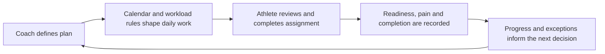

# Player Development OS

**AI-assisted athlete development platform | Public product portfolio**

Player Development OS is a product designed to help baseball athletes, guardians, and coaches turn long-term development goals into safe, calendar-aware daily execution.

This repository is a **sanitized public product portfolio**. It demonstrates product discovery, workflow design, prioritization, safety and privacy decisions, AI-assisted development, testing, and commercialization planning. It contains no real youth-athlete identity, private calendar data, credentials, health information, or production records.

[View the synthetic public demo](https://player-development-os.nikolz78.chatgpt.site/) · [Read the product story](docs/PRODUCT-STORY.md) · [Review major decisions](docs/PRODUCT-DECISIONS.md) · [See the roadmap](docs/ROADMAP.md)

## The problem

Youth baseball development is fragmented across team schedules, private instruction, strength work, throwing programs, recovery, nutrition, and informal communication. Athletes and families often reconcile those inputs manually, while coaches lack a consistent view of what was assigned, completed, changed, or missed.

## The product response

Player Development OS brings those workflows into one operating loop:

## My role

I conceived the product and led the work across:

- product discovery and problem definition;
- product strategy and roadmap development;
- workflow and interaction design;
- requirements and acceptance criteria;
- AI-assisted product development;
- safety, privacy, and youth-data constraints;
- testing, release evidence, and operational documentation;
- pilot planning and commercialization analysis.

## Product capabilities

- Calendar-aware daily assignments
- Coach planning and overrides
- Readiness and pain gating
- Rolling throwing-workload controls
- Practice and game reconciliation
- Progress, command, velocity, strength, and recovery tracking
- Athlete engagement mechanics
- Role-based access and guardian workflows
- Multi-athlete product architecture in development

## What this portfolio demonstrates

This project provides direct evidence of the ability to:

- identify a real operational problem;
- translate domain knowledge into product requirements;
- design an end-to-end user workflow;
- make and document product and technical tradeoffs;
- build and test an AI-assisted product;
- establish privacy and safety constraints;
- iterate toward a scalable commercial model.

## Current stage

| Area | Status |
|---|---|
| Working product prototype | Complete |
| Synthetic public demonstration | Live |
| Product, safety, architecture, and operating model | Documented |
| Multi-athlete identity and onboarding foundation | In development |
| Coach dashboard and pilot preparation | In progress |
| Commercial launch | Not yet launched |

## Portfolio map

- [Product story](docs/PRODUCT-STORY.md)
- [Major product decisions](docs/PRODUCT-DECISIONS.md)
- [Product roadmap](docs/ROADMAP.md)
- [Safety and privacy boundary](docs/SAFETY-AND-PRIVACY.md)
- [Build and operating approach](docs/BUILD-APPROACH.md)
- [Public demo](https://player-development-os.nikolz78.chatgpt.site/)

## Important boundary

The active production and development repository remains private. This public repository intentionally excludes source code, credentials, private deployment details, real athlete information, private calendars, and sensitive performance or health records.
