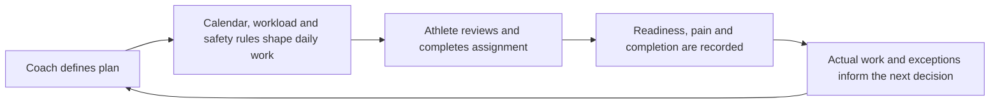

# Player Development OS

**AI-assisted athlete development platform | Public product portfolio**

Player Development OS is a product designed to help baseball athletes, guardians, and coaches turn long-term development goals into safe, calendar-aware daily execution.

This repository is a **sanitized public product portfolio** focused specifically on Player Development OS. It demonstrates product discovery, workflow design, prioritization, safety and privacy decisions, AI-assisted development, testing, release governance, pilot preparation, and commercialization planning. It contains no real youth-athlete identity, private calendar data, credentials, health information, or production records.

[View the synthetic public demo](https://player-development-os.nikolz78.chatgpt.site/) · [Read the case study](docs/CASE-STUDY.md) · [Tour the product operating record](docs/REPOSITORY-TOUR.md) · [See the roadmap](docs/ROADMAP.md)

## The problem

Youth baseball development is fragmented across team schedules, private instruction, strength work, throwing programs, recovery, nutrition, and informal communication. Athletes and families often reconcile those inputs manually, while coaches lack a consistent view of what was assigned, completed, changed, or missed.

## The product response

Player Development OS brings those workflows into one operating loop:

## My role

I conceived the product and led the work across:

- product discovery and problem definition;
- product strategy and roadmap development;
- workflow and interaction design;
- requirements and acceptance criteria;
- AI-assisted product development;
- safety, privacy, and youth-data constraints;
- testing, release evidence, and operational documentation;
- pilot planning and commercialization analysis.

## Product capabilities

- Calendar-aware daily assignments
- Coach planning and overrides
- Readiness and pain gating
- Rolling throwing-workload controls
- Practice and game reconciliation
- Deterministic plan reconciliation after disruptions
- Shared assignment and logging prescriptions
- Progress, command, velocity, strength, and recovery tracking
- Age-appropriate athlete engagement mechanics
- Athlete profile and assigned-coach context
- Role-based access and guardian workflows
- Multi-athlete product architecture in controlled staging

## August 14, 2026 product update

Player Development OS has advanced materially since the first public portfolio snapshot.

### P2 multi-athlete expansion

- P2 has advanced from architecture and onboarding definitions into a controlled multi-role staging product with release-control evidence, athlete-profile work, rendered-role infrastructure, and pilot-gate enforcement.
- Mobile athlete-profile presentation was tested with synthetic fixtures and accepted after real-device review; disposable review records were removed after validation.
- Release controls were strengthened so pilot activation depends on retained hosted evidence rather than source completion alone.
- The August 14 weekly close retained the external pilot as **not yet activated**: hosted acceptance, exact runtime/data-state evidence, cleanup evidence, and remaining pilot gates still control family contact.
- The original single-athlete product remains isolated from P2 and external pilot work.

### Planning and safety logic

- Safety restrictions generate the final actionable assignment rather than appearing beside a conflicting throwing plan.
- Strength assignments and completed-work logging resolve from the same exercise, set-count, and effort prescription.
- Rolling plan reconciliation preserves phase intent while accounting for actual workload, readiness restrictions, team-calendar changes, displaced work, recovery sequences, and return bridges.
- Age-adaptive engagement behavior has advanced through the technical gate while guardian/minor-response treatment remains subject to the appropriate legal and pilot controls.

### Support and commercialization preparation

- A canonical voluntary-support model was defined using Stripe-hosted payment flows rather than custom payment handling.
- Support is intentionally separate from athlete entitlement: contributing does not buy coaching access, change product permissions, or weaken pilot gates.
- Pricing, entitlement, expiration, revocation, refund, and access-boundary work remains governed by the staged pilot and commercialization roadmap.

[Review the current public roadmap](docs/ROADMAP.md)

## What this portfolio demonstrates

This project provides direct evidence of the ability to:

- identify a real operational problem and define a narrow product wedge;
- translate domain knowledge into product requirements;
- design an end-to-end user workflow;
- make and document product and technical tradeoffs;
- use AI-assisted development while retaining requirements, tests, evidence, and ownership;
- establish privacy, safety, access, and release constraints;
- reconcile defects consistently across product environments;
- operate through explicit gates, evidence, and work-in-progress limits;
- evolve a working single-user product toward a controlled multi-user platform;
- iterate toward a scalable commercial model without allowing monetization to outrun product readiness.

## Current stage

| Area | Status |
|---|---|
| Working single-athlete PDOS product | Operational |
| Synthetic PDOS public demonstration | Live |
| Product, safety, architecture, and operating model | Documented |
| Rolling plan reconciliation | Passed across working product, demo, and staging |
| P2 multi-athlete foundation | Advanced controlled staging; external pilot not activated |
| Athlete profile / role presentation | Synthetic hosted cycle completed; broader integrated gate continues |
| Release and pilot controls | Implemented in source; hosted acceptance/evidence still gating activation |
| Voluntary Stripe support | Implemented/documented on approved adult-facing surfaces; separate from entitlement |
| External pilot activation | Not yet activated; evidence gates remain binding |
| Commercial PDOS launch | Not launched |

## Portfolio map

- [Product case study](docs/CASE-STUDY.md)
- [Repository and operating-record tour](docs/REPOSITORY-TOUR.md)
- [Product story](docs/PRODUCT-STORY.md)
- [Major product decisions](docs/PRODUCT-DECISIONS.md)
- [Product roadmap](docs/ROADMAP.md)
- [Safety and privacy boundary](docs/SAFETY-AND-PRIVACY.md)
- [Build and operating approach](docs/BUILD-APPROACH.md)
- [Public demo](https://player-development-os.nikolz78.chatgpt.site/)
- [Michael J. Nichols — GitHub profile](https://github.com/MichaelJNichols)

## Important boundary

The active Player Development OS production and development repository remains private. This public repository intentionally excludes source code, credentials, private deployment details, real athlete information, private calendars, sensitive performance or health records, unapproved legal material, and copyrighted training resources that are not authorized for redistribution.
