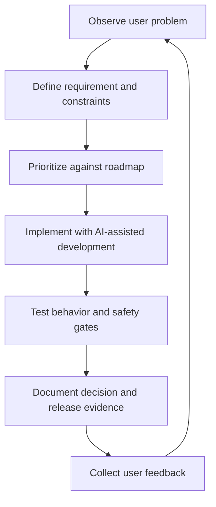

# Build and Operating Approach

Player Development OS was built through an AI-assisted product-development workflow. The relevant skill demonstrated is not simply generating code. It is maintaining product intent, constraints, evidence, and operating discipline while implementation moves quickly.

## Working model

## Product responsibilities

- Define the problem and target user behavior
- Separate requirements from implementation ideas
- Establish acceptance criteria
- Prioritize safety, privacy, and workflow dependencies
- Review outputs rather than treating AI generation as inherently correct
- Preserve traceability through issues, decisions, tests, and releases
- Distinguish current behavior from future architecture
- Keep public demonstration data structurally separated from private use

## Technical collaboration model

The project uses AI as an implementation and analysis partner while retaining human accountability for:

- product direction;
- business rules;
- user experience;
- privacy boundaries;
- safety requirements;
- testing expectations;
- release decisions;
- truthful representation of what is and is not complete.

## Quality controls

The private build includes automated and manual checks covering areas such as:

- authentication and role boundaries;
- calendar behavior;
- workload and safety rules;
- rendering and regression behavior;
- environment separation;
- prevention of private information entering the synthetic demo;
- release and documentation consistency.

Specific source code, private configuration, production records, and deployment details are intentionally excluded from this public portfolio.

## Why this matters

AI-assisted development can produce visible output quickly. The harder work is ensuring the product remains understandable, testable, safe, and aligned to a real user problem. This project demonstrates that broader operating discipline.
