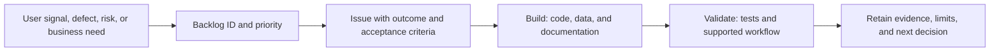

# Player Development OS — Repository Tour

This public tour explains how the private working repository is used as both a software repository and a product operating record. It intentionally excludes source code, private identifiers, credentials, real youth data, exact staging details, and unapproved legal material.

## Three jobs of the repository

### 1. Working product

The private repository holds application screens, server routes, domain logic, database schema and migrations, tests, PWA configuration, and runtime setup.

### 2. Product-management system

The documentation layer holds the roadmap, backlog, operating system, current-state baseline, release rules, glossary, risks, legal and pilot preparation, and business-readiness work.

### 3. Evidence trail

Issues, commits, test results, gate evidence, architecture decisions, known limitations, and release records preserve why work changed, how it was validated, and what remains incomplete.

> Code shows what changed. The full repository shows why it changed, how it was governed, and what evidence supports the claim.

## How work moves from signal to proof

Material work is not considered complete solely because a feature appears to function. The repository retains the acceptance criteria, validation result, known limitations, and decision boundary.

## Controlled product expansion

The product has expanded in stages rather than through a direct rewrite:

1. Working single-athlete product loop
2. Synthetic public demonstration
3. Multi-athlete product and technical blueprint
4. Isolated staging environment
5. Identity, authorization, and onboarding gates
6. Versioned plan-generation workflow
7. Entitlement, audit, coach workflow, legal, migration, and pilot-readiness gates

The operating principle is to protect the working product while validating the next architecture with synthetic data and retained evidence.

## Major repository concepts

| Concept | Purpose |
|---|---|
| Roadmap | Defines sequencing and why one initiative precedes another |
| Backlog IDs | Give material work a stable identity across issues, code, tests, and evidence |
| Architecture decisions | Record consequential choices and tradeoffs |
| Gate evidence | Shows what was tested, what passed, and what limitations remain |
| Current-state record | Prevents planned work from being described as complete |
| Synthetic staging | Allows multi-user and denial-path testing without exposing real youth data |
| Work-in-progress limit | Forces completion, reduces context switching, and makes blockers visible |

## Example feature trace

A typical feature can be explained through the following chain:

- **Need:** Different athletes require individualized plans rather than copied logic.
- **Contract:** Define templates, generator versions, coach review, preserved history, and denial rules.
- **Build:** Implement the plan engine, API behavior, data migration, and deterministic tests.
- **Gate:** Generate, review, publish, regenerate, and confirm preserved completed history in synthetic staging.
- **Evidence:** Retain the issue, implementation references, test result, checkpoint, and known limits.

This is the core management pattern used throughout the project: **need → contract → build → gate → evidence**.

## Safe interview framing

Player Development OS began as a working product for managing one developing athlete’s offseason baseball plan. The central problem was translating long-term strategy into the correct assignment today while accounting for team events, actual workload, readiness, pain signals, and coach decisions.

GitHub became both the source-code repository and the product operating record. It contains the application, data changes, tests, roadmap, backlog, architecture decisions, pilot preparation, and retained evidence. The public portfolio exposes the product-management story while the active repository remains private.

## Claim boundary

The repository supports claims about product discovery, workflow design, documented tradeoffs, AI-assisted delivery, testing, privacy and safety requirements, and gated expansion. It does not support claims of product-market fit, commercial scale, medical outcomes, or broad external adoption.

## Related public material

- [Portfolio home](../README.md)
- [Product case study](CASE-STUDY.md)
- [Product story](PRODUCT-STORY.md)
- [Major decisions](PRODUCT-DECISIONS.md)
- [Roadmap](ROADMAP.md)
